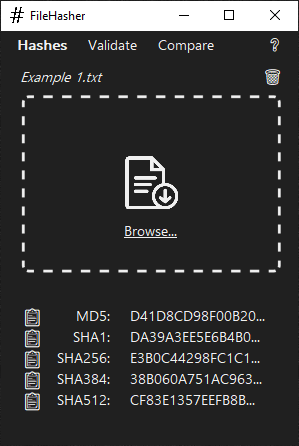
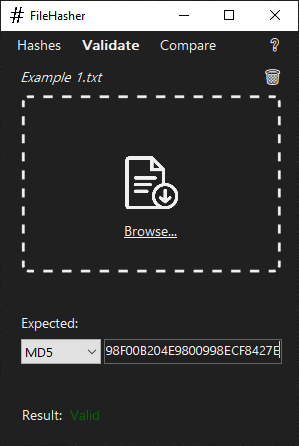
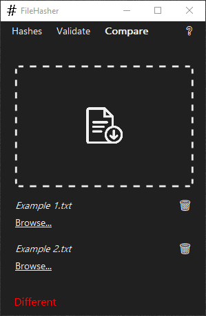

# FileHasher

A Windows desktop app for cryptographically computing file hashes, validating checksums, and comparing data.

## Table of Contents

1. [Getting Started](#getting-started)
2. [Guide](#guide)
3. [Technologies](#technologies)

## Getting Started

TODO

## Guide

### Hashes Panel

The Hashes panel allows the computation of a file's hashes using multiple different algorithms. A file can either be dragged and dropped on the window or manually selected using the Browse... feature.

- **Browse...**: opens a dialog to select a file.
- **📋**: copies the hash to the clipboard.
- **🗑️**: clears the current file's hashes.
- **❔**: opens the README on GitHub.

### Validate Panel

The Validate panel allows the validation of an expected file hashes compared against a computed hash of a provided file.

- **Dropdown**: allows selection of the hashing algorithm.
- **Text box**: allows input of the expected hash.

### Compare Panel

The Compare panel allows the contents of 2 file's data to be hashed and compared using SHA512.

## Technologies

- **OS**: Windows
- **IDE**: Visual Studio
- **Programming Language**: C#
- **Framework**: .NET
- **UI**: Windows Forms
- **Version Control**: Git / GitHub
- **Algorithms**: MD5, SHA1, SHA256, SHA384, SHA512
