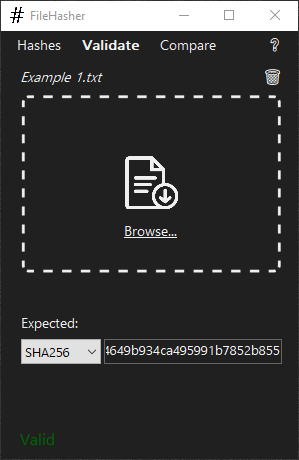

# FileHasher

A Windows desktop app for cryptographically computing file hashes, validating checksums, and comparing data.

## Table of Contents

1. [Getting Started](#getting-started)
2. [Guide](#guide)
3. [Technologies](#technologies)

## Getting Started

<details>
<summary><strong>Run from executable</strong></summary>

1. Download [FileHasher-x64.exe](https://github.com/EvanHei/FileHasher/releases/download/v1.0.0/FileHasher-x64.exe) or [FileHasher-x86.exe](https://github.com/EvanHei/FileHasher/releases/download/v1.0.0/FileHasher-x86.exe) depending on your architecture.

   | File               | SHA-256                                                            |
   | ------------------ | ------------------------------------------------------------------ |
   | FileHasher-x64.exe | `957e1f2be0ce074192af620edcfadef2805765ed99efc09b54fef98f349c9ff7` |
   | FileHasher-x86.exe | `1d9ca1aab24bbe53d2ddfa69be1d7c04681b60ba941a16d768ce37f438c21190` |

2. Double-click the executable, click "More info", and then click "Run anyway". This prompt will disappear the next time FileHasher is run.

   

</details>

<details>
<summary><strong>Run from source code</strong></summary>

1. Download the .NET SDK from Microsoft's website <a href="https://dotnet.microsoft.com/download"> here</a> or verify installation by running the following command:

   ```bash
   dotnet --version
   ```

2. Navigate to FileHasher/WinFormsUI/ and launch with the following command:

   ```bash
   dotnet run
   ```

</details>

## Guide

### Hashes Panel

The Hashes panel allows the computation of a file's hashes using multiple different algorithms. A file can either be dragged and dropped on the window or manually selected using the Browse... feature.

- **Browse...**: opens a dialog to select a file.
- **📋**: copies the hash to the clipboard.
- **🗑️**: clears the current file's hashes.
- **❔**: opens the README on GitHub.


### Validate Panel

The Validate panel allows the validation of an expected file hashes compared against a computed hash of a provided file.

- **Dropdown**: allows selection of the hashing algorithm.
- **Text box**: allows input of the expected hash.



### Compare Panel

The Compare panel allows data from 2 files to be hashed and compared using SHA512.


## Technologies

- **OS**: Windows
- **IDE**: Visual Studio
- **Language**: C#
- **Framework**: .NET
- **UI**: Windows Forms
- **Version Control**: Git / GitHub
- **Algorithms**: MD5, SHA1, SHA256, SHA384, SHA512
- **Unit Tests**: xUnit
